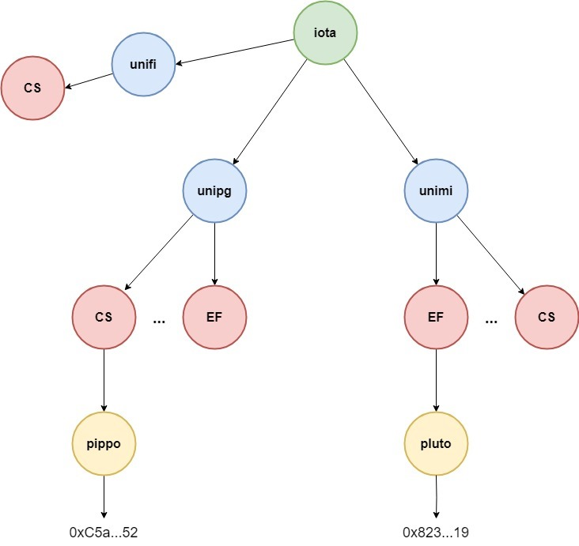

# ID-IOTA: Decentralized DNS on the IOTA Blockchain

A decentralized DNS system built on the IOTA blockchain, enabling users to create and manage domains and subdomains linked to their addresses or Decentralized Identifiers (DIDs).

---

### ✍️ **Authors**

This project was created by:

- **Chiara Luchini** - University of Perugia
- **Angelo Murano** - University of Salerno
- **Simone Valentini** - University of Milan

---

## 📚 Table of Contents
* [Description](#description)
* [How to Use](#how-to-use)
* [Setup](#setup)

---

## 📝 Description <a name="description"/>

The **IOTA-ID DNS Module** is a solution for decentralized domain name management on the IOTA blockchain, functioning as a Blockchain Domain Name System (BDNS). Unlike traditional DNS systems, which are centralized and prone to various vulnerabilities, our BDNS leverages the tree-like data structure of the IOTA blockchain to create a secure, transparent, and censorship-resistant environment for managing domains and subdomains.

### Key Features and Functionality

- **🌳 Tree-like Data Structure**: At the core of this module is a hierarchical tree structure, where each node represents an object, specifically an IOTA Shared Object. This means that every node in the tree is public, visible, and modifiable by all users through the functions provided by our smart contract. This openness ensures that the domain name management process is both transparent and decentralized.

- **🔑 Ownership and Control**: Each node in the tree has an owner, who possesses full control over their respective domains and subdomains. Owners can create new subdomains, link them to unique addresses, or remove them as needed. The power to manage these subdomains is proportional to the position of the node within the tree.

- **⚡ Optimized Address Lookup**: The tree structure is not just a metaphor but a practical optimization. Searching for an address within this hierarchical structure is far more efficient than in a flat list, as the tree allows for quicker and more organized data retrieval. This means that as the number of domains and subdomains grows, the system remains scalable and efficient.

### Why Use IOTA-ID DNS?

Our module empowers individuals and organizations to manage their digital identities and decentralized resources with greater security and autonomy. Whether you're building a decentralized application, managing digital identities, or simply looking for a censorship-resistant DNS solution, the IOTA-ID DNS Module provides the tools and infrastructure to do so with confidence.

### :rocket: Future works

One future development would include the Decentralized Identifiers (DIDs) of the relevant entities in addition to IOTA addresses in the tree leaves. DIDs are unique identifiers that can be resolved into DID documents containing public information such as the entity's public keys. For more information, please refer to the [IOTA DID documentation](https://wiki.iota.org/identity.rs/explanations/decentralized-identifiers/).

---

## 🛠️ How to Use <a name="how-to-use"/>

The **IOTA-ID DNS Module** operates through a structured and logical approach that revolves around the concept of a "Node." Understanding the structure of a Node is essential to grasp how the module functions and how you can utilize it to manage domains and subdomains effectively.

For this project we published an example tree which represents a set of URIs for different organizations, in this case different universities. Each univerity encompasses different deparments and, finally, every department encompasses employers addresses as follows:



### The Node Structure

A Node represents the fundamental unit within the tree-like hierarchy of the IOTA-ID DNS system. Each Node corresponds to a domain or subdomain and is defined by three primary attributes:

1. **ID**: A unique identifier for the Node.
2. **Name**: The name assigned to the Node, representing the domain or subdomain.
3. **Owner**: An address that holds ownership and control over the Node.

This Node structure allows each domain and subdomain to be a distinct, identifiable entity within the decentralized DNS system, facilitating organized management and retrieval.

### Main Functions

The module is composed of four main functions that enable the creation, management, and querying of domains and subdomains. Below is an overview of these functions, including their inputs, outputs, and a brief explanation of their roles:

1. **➕ add_subdomain**:
   - **Inputs**: 
     - The root Node.
     - The vector of subdomains bringing to the **parent** Node.
     - The name of the new **child** Node
     - The address of the subdomain's new owner.
   - **Description**: This function is used to create a new subdomain under a specified parent Node. The function generates a new Node for the subdomain, assigns it a name and owner, and marks it as a shared object, meaning it is visible and modifiable within the IOTA network. The subdomain's Node is then added to the parent Node using Dynamic Fields, establishing the hierarchical relationship between the domain and its subdomain.

2. **🗑️ remove_subdomain**:
   - **Inputs**: 
     - The root Node.
     - The vector of subdomains bringing to the **parent** Node.
     - The name of the subdomain to be removed.
   - **Description**: This function allows the owner of a Node to remove an existing subdomain. By providing the name of the subdomain and the parent Node, the function uses Dynamic Fields to remove the subdomain's Node from the parent Node, effectively removing it from the hierarchical structure.

3. **🪢 get_node**:
   - **Inputs**:
     - The root Node. 
     - The vector of subdomains bringing to a Node.
   - **Outputs**: a Node object.
   - **Description**: This function retrieves the Node object following a specified Uri and returns it, this function is mainly internally used.

4. **🔍 get_address**:
   - **Inputs**: 
     - The root Node.
     - The vector of subdomains bringing to a Node.
   - **Description**: This function allows users to obtain the owner address of a subdomain under a given Node. By providing the root Node and the subdomain vector, the function retrieves the subdomain's owner, creates an Address object and sends it to the **sender**.

---

## ⚙️ Setup <a name="setup"/>

Setting up the **IOTA-ID BDNS Module** involves preparing your development environment, installing necessary dependencies, and configuring the module for use. Follow the steps below to get started.

### 📋 Prerequisites

Ensure you have the following installed on your system:

- **Node.js** (v20 or higher)

### 📝 Setup Instructions

Execute the following commands in your terminal:

```bash

# Clone the repository

# Navigate to the iota directory root
cd iota

# Install all dependencies
pnpm install

# Build the IOTA SDK
pnpm sdk build

# Navigate to the client-js directory
cd dapps/ID-IOTA/client-js

# Install all client-side dependencies
pnpm install

# Link the local IOTA SDK TypeScript package to the client application
pnpm link ../../../sdk/typescript/

# Inside the file main.ts, you shall edit COMPLETE_URI with the URI corresponding to the address you want to retrieve (g.e. "pippo.CS.unipg.iota"), and MNEMONIC with the mnemonic of the account you want to perform the transaction with.

# Run the client application
pnpm run exec

```

