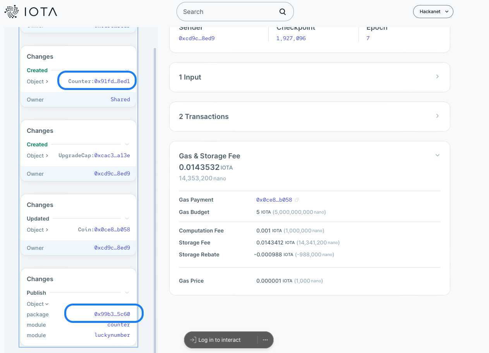

# 🚀 Client provider

## 🎉 Introduction

Welcome to the Client Provider, a robust solution designed for seamless and secure interaction with Move smart contracts. In the rapidly evolving landscape of blockchain technology, maintaining the alignment between your on-chain contracts and client-side code is crucial. Our Client Provider ensures that your interactions with Move contracts are not only efficient but also type-safe, reducing the risk of errors and vulnerabilities.

This tool automatically generates a TypeScript interface tailored to your specific Move contracts, ensuring that your client-side code remains up-to-date with the latest contract changes. By leveraging TypeScript’s strong typing system, our Client Provider catches potential bugs at **COMPILE** time, significantly lowering the risk of runtime errors and enhancing overall code safety.

## 🏁 Get started

### 🔄 Clone the repository branch

```bash
git clone -b movers/client-provider git@github.com:temp-dlt-school-24-org/iota.git
cd iota
```

### 🛠️ Build and link the TypeScript SDK

From the root `iota` folder:

```bash
pnpm install 
pnpm sdk build
```

From the `client-provider` folder: 

```bash 
cd dapps/client-provider
pnpm link ../../sdk/typescript
```

### 📄 Create a `.env` file 

```bash 
touch .env
```

This file must define the passphrase for the Ed25519 private key, the RPC url for interacting with the chain and the faucet url.

#### ✏️ Example

```bash
#.env

IOTA_CP_PASSPHRASE=insert your passphrase here

IOTA_CP_RPC=https://api.hackanet.iota.cafe/
IOTA_CP_FAUCET=https://faucet.hackanet.iota.cafe/gas
```

## 🧑‍💻 How to use

Once you have deployed a contract module to the chain, you can use the client provider to interact with it. Before you have to parse the module to generate the IDL:

```bash 
npm run parse-module <path/to/your/contract.move>
```

The parser will produce an IDL in the `src/idl` folder:

```ts
// src/idl/MyModuleIdl.ts

// AUTOGENERATED FILE. DO NOT EDIT.

import {ObjId} from "../types" 

export type MyModuleIdl = {
  my_method: { param1: ObjId, param2: number },
};

export const moduleName = "my_module_name";
```

You can now use the IDL to interact with the module:

```ts
import { ClientProvider } from "../idl-provider/idl-provider";
import { MyModuleIdl, moduleName } from "../idl/MyModuleIdl";

const cp = new ClientProvider<MyModuleIdl>({
    rpcUrl: process.env.IOTA_CP_RPC,
    package: "Your package address",
    module: moduleName,
    signer: 'Your keypair'
})

const response = await cp.invoke("moduleName", { 
    user_counter: { param1: "0x..ad36" },
    param2: 42 
})
```

## 📝 Example: Calling the get_flag method of the luckynumber module

📦 Deploy the example contract:
```bash
cd src/contracts/challenge_2
iota client publish --gas-budget 5000000000
```

🔍  Get the transaction digest and search it in the [explorer](https://explorer.hackanet.iota.cafe/) and take the `PACKAGE_ADDRESS` and the user `COUNTER_ADDRESS`.



🔙 Return to the client provider folder:
```bash
cd ../../../
```

📜 Parse the luckynumber module:
```bash 
npm run parse-module src/contracts/challenge_2/sources/luckynumber.move
```

The parser produces an IDL in the `src/idl` folder.

```ts
// src/idl/CtfLuckynumberIdl.ts

// AUTOGENERATED FILE. DO NOT EDIT.

import {ObjId} from "../types" 

 export type CtfLuckynumberIdl = {
  get_flag: { user_counter: ObjId, lucky_num: number },
};

export const moduleName = "luckynumber";
```

🧪 At the end you can run interact with the contract (`npm run tests`) by inserting the `PACKAGE_ADDRESS` and the user `COUNTER_ADDRESS` obtained from the explorer:

```ts
import { ClientProvider } from "../idl-provider/idl-provider";
import { CtfLuckynumberIdl, moduleName } from "../idl/CtfLuckynumberIdl";

const cp = new ClientProvider<CtfLuckynumberIdl>({
        rpcUrl: process.env.IOTA_CP_RPC,
        package: "PACKAGE_ADDRESS",
        module: moduleName,
        signer
    })

const response = await cp.invoke("get_flag", { 
        user_counter: { id: "COUNTER_ADDRESS" },
        lucky_num: 1 
    })
```
